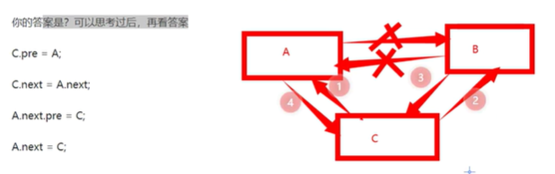

# 一、Java基础

### **1. 基础的数据类型都有哪些？**

byte(1字节)、boolean(2/4)、char(2)、short(2)、int(4)、float(4)、long(8)、double(8)

### **2. final 在 java 中有什么作用？**

- final 修饰的类叫最终类，该类不能被继承。
- final 修饰的方法不能被重写。
- final 修饰的变量叫常量，常量必须初始化，初始化之后值就不能被修改。

### 3. == 和 equals 的区别是什么？

== 对于基本类型来说是值比较，对于引用类型来说是比较的是引用；

而 equals 默认情况下是引用比较，只是很多类重新了 equals 方法，比如 String、Integer 等把它变成了值比较，所以一般情况下 equals 比较的是值是否相等。

```java
String s1 = new String("zs"); // 0x001
String s2 = new String("zs"); // 0x002
System.out.println(s1 == s2); //false 指向的引用地址不同

String s3 = "zs"; //0x003
String s4 = "zs"; //0x003
System.out.println(s3 == s4); //true s3 s4 指向的都是字符串常量池地址
System.out.println(s3 == s1); //false 指向地址不同

String s5 = "zszs"; // 字符串常量池地址 0x003
String s6 = s3 + s4; // 字符串变量相加时 会重新new出一个对象，s6指向新的引用地址  0x004
System.out.println(s5 == s6); // false

final String s7 = "zs"; //常量 0x003
final String s8 = "zs"; // 常量 0x003
String s9 = s7 + s8; // 常量相加是在字符串常量池中操作的 0x003
System.out.println(s5 == s9); // true 指向的都是0x003
final String s10 = s3 + s4; // s10指向的是0x003，s3 + s4会new出一个新对象
System.out.println(s5 == s10); // false
```

### 4. 两个对象的 hashCode()相同，则 equals()也一定为 true，对吗？

不对，两个对象的 hashCode()相同，equals()不一定 true。

```java
String str1 = "通话";
String str2 = "重地";
System.out.println(String.format("str1：%d | str2：%d",  str1.hashCode(),str2.hashCode()));
System.out.println(str1.equals(str2));
```

执行的结果：

str1：1179395 | str2：1179395
false

**总结：** 

​		很显然“通话”和“重地”的 hashCode() 相同，然而 equals() 则为 false，因为在散列表中，hashCode()相等即两个`键值对的哈希值相等`，然而哈希值相等，并不一定能得出键值对相等。

### **5. String  StringBuffer StringBuilder区别**

> String与其他两个类的区别

String是一个不可变的对象，指向的引用地址不能改变，但是内容可以改变。每次操作都会产生新的对象，指针指向新String对象

StringBuffer StringBuilder都是可变，都是在原有对象上操作。

> StringBuffer vs StringBuilder

前者线程安全，后者线程不安全

**什么情况下，我们会考虑线程安全问题？**

多线程访问同一个资源的时候，才会考虑线程安全问题

**如何判断一个对象是线程安全？**

1.多线程环境下

2.对这个对象的访问不需要加入额外的同步操作

3.操作数据的结果依然是正确的

**实际开发中，采用哪个？**

线程不安全性能更高，在实际开发中优先使用StringBuilder。

性能：StringBuilder > StringBuffer > String

**StringBuilder线程不安全，为什么还采用它？**

实际开发中StringBuilder.append用在方法内，不是成员变量，构不成线程安全

### **6. 接口和抽象类有什么区别？**

**JDK1.8之前**

- 语法
    - 抽象类：方法可以有抽象的，也可以有非抽象的 有构造器
    - 接口：方法都是抽象 属性都是常量，默认有 public static final修饰
- 设计
    - 抽象类：从下到上对同一事物抽象，例如对DAO层操作的封装 如 BaseDao
    - 接口：系统之间对接的标准,一种规范/约定 实现代码解耦

**JDK1.8后**

- 接口里面可以`有实现的方法`，方法声明上加上`default或static`

**区分几个概念：**

接口可以多继承、多实现，类只能单继承

### **7. 普通类和抽象类有哪些区别？**

- 普通类不能包含抽象方法，抽象类可以包含抽象方法。
- 抽象类不能直接实例化，普通类可以直接实例化。

### **8. 抽象类能使用 final 修饰吗？**

不能，定义`抽象类就是让其他类继承的`，如果定义为 final 该类就不能被继承，这样彼此就会产生矛盾，所以 final 不能修饰抽象类。

### **9.Integer&int(缓存&自动装箱&自动拆箱)**

```java
Integer i1 = 12;
Integer i2 = 12;
System.out.println(i1 == i2); // true -128到127之间的从缓存中拿 指向的缓存地址相同

Integer i3 = 126;
Integer i4 = 126;
int i5 = 126;
System.out.println(i3 == i4); // true -128到127之间的从缓存中拿 指向的缓存地址相同
System.out.println(i3 == i5); // true 自动拆箱 比较的是数值

Integer i6 = 128;
Integer i7 = 128;
int i8 = 128;
System.out.println(i6 == i7); // false -128到127会重新new 指向的地址不相同
System.out.println(i6 == i8); // true 自动拆箱 比较的是数值
```

### **10.方法重载和重写**

重载：发生在一个类里面 方法名相同，方法列表 和方法返回值无关

重写:  发生在父类子类之间，方法名相同，参数列表相同

# 二、容器

## List和Set的区别

List：有序 可重复

Set：无需不可重复

## List

### 1.ArrayList

#### 1.ArrayList默认初始容量是多少？

​	答案是 10。当你知道需要存储多少数据时，建议在创建的时候 直接设置初始容量

#### **2.ArrayList如何扩容？**

​	1.创建一个新数组。每次扩容都是原来容量的1.5倍，直到Integer的最大值，是通过`位运算`的方式得到

​	2.将原数组的数据在迁移到新数组

#### 3.线程安全吗？

​	它是线程不安全的

### 2.LinkeList

#### 1.如何在双向链表A和B之间插入C？

C.pre =A

C.next=A.next

A.next.pre=C

A.next =C



### 3.ArrayList和LinkedList区别

**1.底层数据结构的差异**

ArrayList 数组，在内存中是一块连续的内存空间 长度固定，一单一开始定义好了长度大小，后期不能再更改了

LinkedList 双向链表，在内存中不是一块连续的内存空间

**2.一个常规的结论**

ArrayList 查找快，因为是连续的内存空间，方便寻址。但删除、插入慢，因为需要发生数据的迁移

LinkedList 查找慢 因为需要通过指针一个一个寻址，但删除、插入快，因为只改变了前后节点的指针指向即可

其实以上说法也不是绝对的，例如ArrayList放入四个元素，LinkedList放入四个元素

ArrayList->a,c,b,d

LinkedList->a,c,b,d

**假设1：**查找第2个元素

ArrayList连续的内存空间，可计算偏移量

LinkedList 不连续的内存空间，无法计算偏移量 只能一个一个查找 

这种情况下就是ArrayList明显大于LinkedList 

**假设2：**查找b在哪里

只能遍历，此时ArrayList和LinkedList 查询半斤八两

**假设3：**在末尾插入元素时

ArrayList和LinkedList都插入速度都差不多

**假设4：**在中间位置插入元素时

ArrayList速度明显慢于LinkedList的速度

**假设5**：明确要存1000个对象，ArrayList和LinkedList哪个更省内存？

答案是：ArrayList。LinkedList每个节点不仅要存储数据本身，还要存储前指针和后指针是谁

## Set

### 1.HashSet底层原理 如何保证唯一性？

**底层原理：**

HashSet的底层采用的是Hashmap实现存储，其值作为HashMap的key，map的value是一个固定不变的值

```java
  private static final Object PRESENT = new Object();
   public boolean add(E e) {
        return map.put(e, PRESENT)==null;
    }

    public HashSet() { //底层就是HashMap
        map = new HashMap<>();
    }
```

## Map

### 1.HashMap

# 三、面向对象

